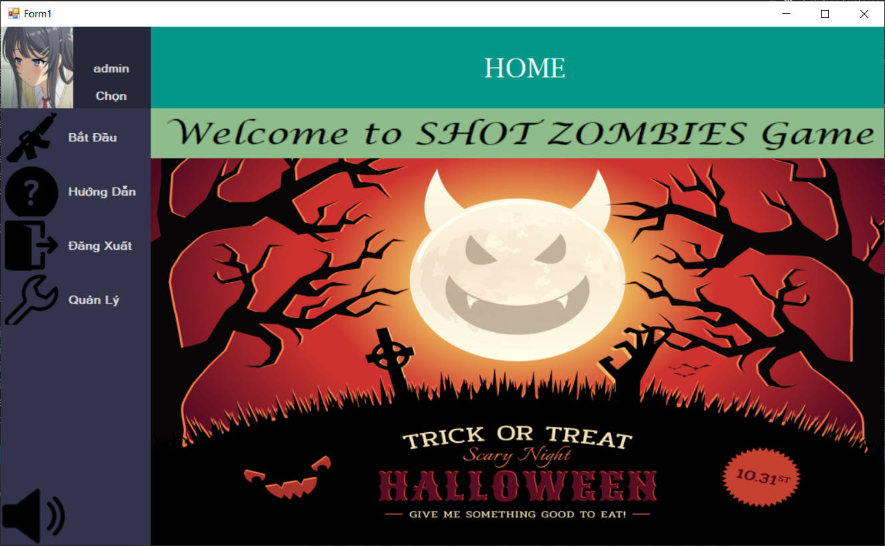
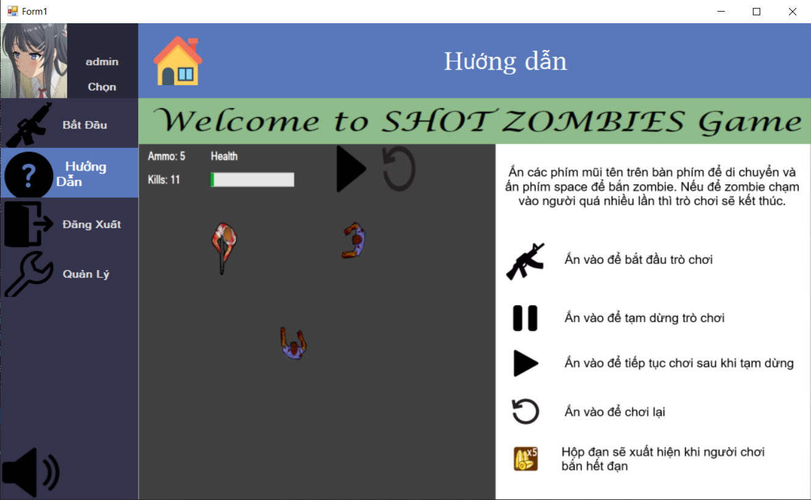
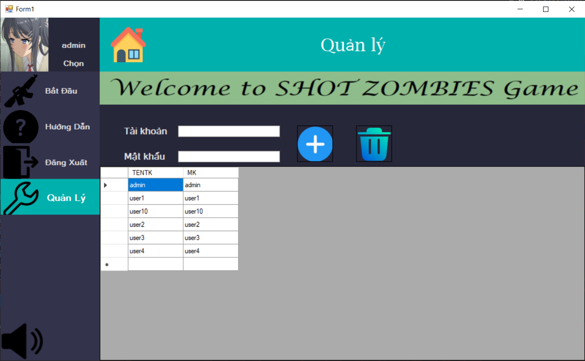
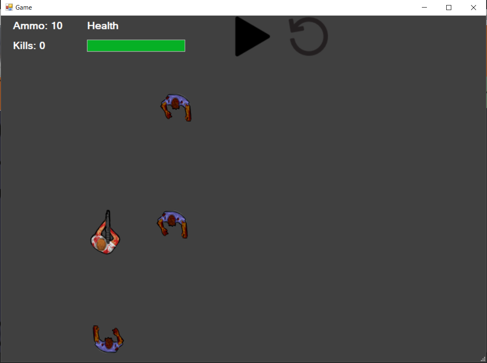

# Lập trình trực quan
<a name="top"><a>
## Mục lục

[Thông tin sinh viên](#info)\
[Đề tài](#topic)\
[Mô tả project](#project)\
&nbsp;&nbsp;&nbsp; [Công nghệ sử dụng](#use)\
&nbsp;&nbsp;&nbsp; [Tính năng chính](#main-feature)\
&nbsp;&nbsp;&nbsp; [Danh sách các màn hình](#screen)\
[Demo](#demo)

## Thông tin sinh viên 

Lớp: **IT008.M11.PMCL** 

| STT  | Tên                | MSSV      |
|:-----|:-------------------|:----------|
|  1   |  Phạm Thanh Phong  | 20520272  |

[Lên đầu trang](#top)
## Đề tài 

Game bắn Zombie

## Mô tả Project 

### Công nghệ sử dụng 

- Ngôn ngữ: C#
- Winform

[Lên đầu trang](#top)
### Tính năng chính 
- Đăng nhập, đăng ký người chơi mới.
- Thêm, xóa, sửa quyền, account người dùng.
- Trò chơi bắn Zombie.

### Danh sách các màn hình 

  
  
  
  

  
[Lên đầu trang](#top)

